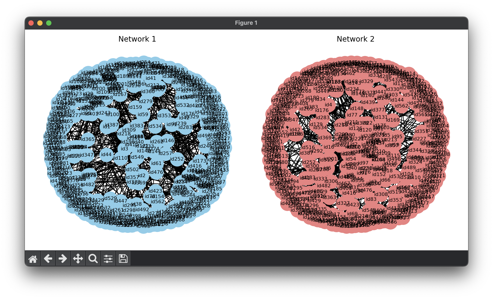

## Network Analysis: Network Visualization

#### ~ Upload both networks as networkX object and graph them:

#### ~ Assess the correlation

Let’s analyze the implications of correlation between these metrics: degree centrality, betweenness centrality, clustering coefficient

- **Degree Centrality and Betweenness Centrality**: A positive correlation between degree centrality and betweenness centrality could indicate that nodes with a higher number of connections also tend to lie on more shortest paths between other nodes. This could imply that highly connected nodes are not only central within their local neighborhoods but also act as bridges between different parts of the network. However, a negative correlation could suggest a different structural pattern, where nodes with many connections tend not to lie on the shortest paths between other nodes.
- **Degree Centrality and Clustering Coefficient**: A positive correlation between degree centrality and clustering coefficient could suggest that nodes with a higher number of connections also tend to be part of densely connected clusters. This would imply that highly connected nodes are not only central within their local neighborhoods but also contribute to the formation of tightly knit groups or communities within the network.
-  **Betweenness Centrality and Clustering Coefficient**: A negative correlation between betweenness centrality and clustering coefficient could suggest that nodes that act as bridges between different parts of the network tend not to be part of densely connected clusters. Conversely, a positive correlation could indicate that nodes with higher betweenness centrality also tend to be part of densely connected clusters.

The most appropriate correlation measure depends on the distribution of the data and the presence of outliers. Spearman correlation is more robust to outliers and does not assume linearity between variables, making it suitable for analyzing relationships between these network metrics, which may not follow a linear relationship. However, Pearson correlation could also be used if the data is normally distributed and there are no outliers present. It’s essential to inspect the distribution of the data and consider the characteristics of the network before choosing the appropriate correlation measure.